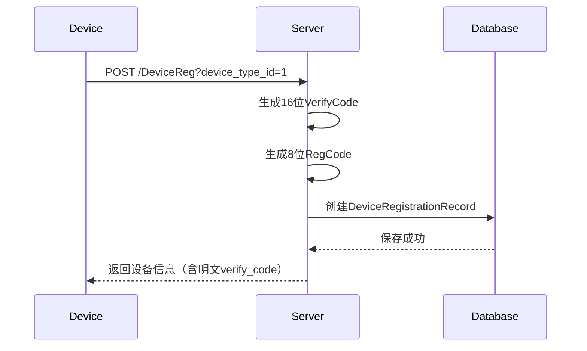
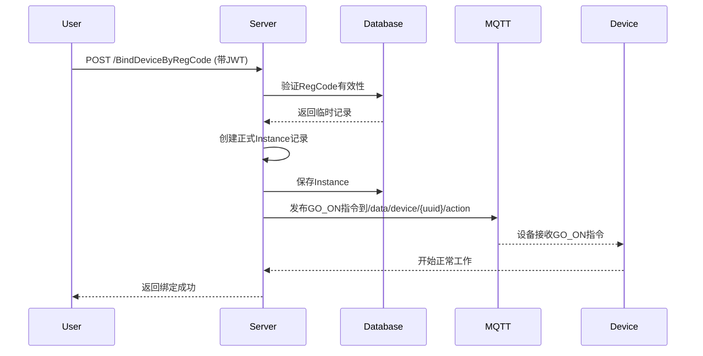

# OMEGA3-IOT 项目开发规范

## 1. 概述

### 1.1 设计原则

```
    - **安全性优先**：所有敏感数据加密存储，通信过程全程认证
    - **可扩展性**：设备类型通过YAML配置管理，支持动态扩展
    - **一致性**：统一的命名规范、数据格式和错误处理机制
    - **解耦设计**：HTTP API、MQTT服务、数据库层完全解耦
```

## 2. 数据模型

### 2.1 用户模型 (User)

#### 字段定义

| 字段名          | 类型        | 描述      | 约束              |
|--------------|-----------|---------|-----------------|
| ID           | uint      | 主键      | 自增              |
| UserUUID     | string    | 用户唯一标识符 | UUID v4 格式，36字符 |
| UserName     | string    | 用户名     | 唯一索引，3-20字符     |
| Type         | int       | 用户类型    | -               |
| Online       | bool      | 在线状态    | -               |
| Description  | string    | 用户描述    | -               |
| LastSeen     | int64     | 最后活跃时间  | Unix时间戳         |
| IP           | string    | 用户IP地址  | -               |
| PasswordHash | string    | 密码哈希值   | bcrypt加密        |
| CreatedAt    | time.Time | 创建时间    | -               |
| UpdatedAt    | time.Time | 更新时间    | -               |
| Role         | string    | 角色      | 带索引             |
| Status       | string    | 状态      | 带索引             |

#### 密码管理方法

- `SetPassword(password string)`: 使用bcrypt(cost=14)加密密码
- `CheckPassword(password string) bool`: 验证密码，返回布尔值

### 2.2 设备模型

#### 2.2.1 Instance (正式设备实例)

| 字段名          | 类型         | 描述      | 约束             |
|--------------|------------|---------|----------------|
| ID           | uint       | 主键      | -              |
| InstanceUUID | string     | 设备唯一标识符 | UUID v4 格式     |
| Name         | string     | 设备名称    | -              |
| Type         | int        | 设备类型ID  | 外键关联DeviceType |
| Online       | bool       | 在线状态    | -              |
| OwnerUUID    | string     | 所有者UUID | 外键关联User       |
| Description  | string     | 描述信息    | -              |
| AddTime      | int64      | 添加时间    | Unix时间戳        |
| LastSeen     | int64      | 最后上线时间  | Unix时间戳        |
| Properties   | Properties | 属性集合    | JSON格式存储       |
| CreatedAt    | time.Time  | 创建时间    | -              |
| UpdatedAt    | time.Time  | 更新时间    | -              |
| VerifyHash   | string     | 验证码哈希值  | SHA-256哈希      |
| SN           | string     | 序列号     | 可选             |
| Remark       | string     | 备注信息    | -              |

#### 2.2.2 DeviceRegistrationRecord (临时注册记录)

| 字段名          | 类型        | 描述      | 约束         |
|--------------|-----------|---------|------------|
| ID           | uint      | 主键      | -          |
| DeviceUUID   | string    | 设备唯一标识符 | UUID v4 格式 |
| RegCode      | string    | 注册码     | 8位随机字符串    |
| DeviceTypeID | int       | 设备类型ID  | -          |
| SN           | string    | 序列号     | 可选         |
| VerifyHash   | string    | 验证码哈希值  | SHA-256哈希  |
| CreatedAt    | time.Time | 创建时间    | -          |
| ExpiresAt    | time.Time | 过期时间    | 带索引，24小时过期 |
| IsBound      | bool      | 是否已绑定   | 带索引        |

#### 2.2.3 DeviceType (设备类型定义)

| 字段名         | 类型                      | 描述      |
|-------------|-------------------------|---------|
| ID          | int                     | 类型ID    |
| Name        | string                  | 类型名称    |
| Description | string                  | 描述      |
| Properties  | map[string]PropertyMeta | 属性元数据映射 |

### 2.3 属性模型

#### 2.3.1 Properties 结构

```go
type Properties struct {
Items map[string]PropertyItem `json:"items"`
}

type PropertyItem struct {
Value string    `json:"value"`
Meta  PropertyMeta `json:"meta"`
}
```

**数据库存储**：实现GORM的Value()和Scan()方法，自动序列化/反序列化为JSON

#### 2.3.2 PropertyMeta 规范

```go
type PropertyMeta struct {
Writable    bool     `json:"writable"`
Description string   `json:"description"`
Unit        string   `json:"unit,omitempty"`
Range       []int    `json:"range,omitempty"`
Format      string   `json:"format,omitempty"` // string/int/float/bool
Enum        []string `json:"enum,omitempty"`
Required    bool     `json:"required,omitempty"` // TODO: 需要实现
Type        string   `json:"type,omitempty"`     // TODO: 需要实现
}
```

### 2.4 消息模型

#### 2.4.1 DeviceMessage (MQTT消息顶层结构)

```go
type DeviceMessage struct {
VerifyCode string          `json:"verify_code"`
TimeStamp  int64           `json:"timestamp"`
Data       MessageData     `json:"data"`
}

type MessageData struct {
Properties map[string]interface{} `json:"properties,omitempty"`
Event      interface{}            `json:"event,omitempty"`
}
```

#### 2.4.2 Action 模型

```go
type Action struct {
Command   string                 `json:"command"`
Params    map[string]interface{} `json:"params"`
Timestamp int64                  `json:"timestamp"`
}
```

## 3. 通信协议

### 3.1 JSON 字段命名规范

- **所有 JSON 字段名使用小写字母**
- **不同单词间使用下划线 `_` 分割**
- **保持一致性，避免混用驼峰命名**

✅ 正确示例：

```
OwnerUUID    string `json:"owner_uuid"`
InstanceUUID string `json:"instance_uuid"`
AddTime      int    `json:"add_time"`
LastSeen     int    `json:"last_seen"`
```

### 3.2 MQTT 通信

#### 3.2.1 主题结构规范
```
data/device/{device_uuid}/
├── properties  # 设备属性上报
├── event       # 设备事件通知  
└── action      # 服务器动作下发
```

#### 3.2.2 Properties 上报格式

**Topic**: `data/device/{device_uuid}/properties`

**Payload**:
```json
{
  "verify_code": "tOFX*mc8=V}?Cnh2",
  "timestamp": 1756882749,
  "data": {
    "properties": {
      "gps_location": {
        "meta": {
          "writable": false,
          "description": "GPS位置",
          "format": "string"
        },
        "value": "39.9042,116.4074"
      },
      "battery_level": {
        "meta": {
          "writable": true,
          "description": "电量",
          "unit": "%",
          "range": [
            0,
            100
          ],
          "format": "int"
        },
        "value": "85"
      }
    }
  }
}
```

#### 3.2.3 Action 下发格式

**Topic**: `data/device/{device_uuid}/action`

**Payload**:
```json
{
  "command": "enable_properties_upload",
  "params": {
    "interval_sec": 30
  },
  "timestamp": 1729450800
}
```

#### 3.2.4 设备认证机制

- **认证方式**：使用VerifyCode进行身份验证
- **验证流程**：
    1. 设备上报数据时携带明文VerifyCode
    2. 服务器计算SHA-256哈希值
    3. 与数据库中存储的VerifyHash比对
    4. 匹配成功则处理请求，否则拒绝

### 3.3 HTTP API

#### 3.3.1 公开端点（无需认证）

| 端点                  | 方法   | 描述     |
|---------------------|------|--------|
| `/api/v1/GetTest`   | GET  | 测试端点   |
| `/api/v1/health`    | GET  | 健康检查   |
| `/api/v1/Register`  | POST | 用户注册   |
| `/api/v1/Login`     | POST | 用户登录   |
| `/api/v1/DeviceReg` | POST | 设备匿名注册 |

#### 3.3.2 受保护端点（需要JWT认证）

| 端点                            | 方法   | 描述            |
|-------------------------------|------|---------------|
| `/api/v1/GetUserInfo`         | GET  | 获取用户信息        |
| `/api/v1/AddDevice`           | POST | 添加设备（内部使用）    |
| `/api/v1/BindDeviceByRegCode` | POST | 通过RegCode绑定设备 |

#### 3.3.3 关键响应示例

**用户注册响应**:

```json
{
  "code": 200,
  "message": "User registered successfully",
  "user": {
    "id": 1,
    "user_uuid": "a1b2c3d4-e5f6-7890-g1h2-i3j4k5l6m7n8",
    "username": "testuser",
    "role": "user",
    "created_at": "2026-01-09T10:00:00Z"
  }
}
```

**用户登录响应**:

```json
{
  "code": 200,
  "message": "Login successful",
  "access_token": "eyJhbGciOiJIUzI1NiIsInR5cCI6IkpXVCJ9...",
  "user": {
    "id": 1,
    "username": "testuser",
    "role": "user"
  }
}
```

**设备匿名注册响应**:

```json
{
  "code": 200,
  "message": "Device Registered successfully",
  "device": {
    "id": 154,
    "uuid": "7b64cea8-ed24-4e73-b0a9-2af503bd4e69",
    "reg_code": "A0WU@HG6",
    "verify_code": "tOFX*mc8=V}?Cnh2",
    "type": 1,
    "expires_at": 1760858932
  }
}
```

**字段说明**:

- `expires_at`: Unix时间戳（秒级），临时凭证有效期
- `verify_code`: 16位校验码，**仅此一次返回明文**，后续只存储哈希值
- `reg_code`: 8位注册码，绑定成功后立即失效

## 4. 业务流程

### 4.1 设备注册流程（两阶段模式）

#### 阶段一：匿名注册



**关键逻辑**:

- 生成16位VerifyCode：包含大小写字母、数字、符号
- 生成8位RegCode：包含大小写字母、数字、符号
- 临时记录有效期：24小时
- 防刷机制：TODO 需要添加IP限流

#### 阶段二：用户绑定



**关键逻辑**:

- 验证RegCode：检查是否有效且未过期
- 创建正式记录：从临时记录转换，添加OwnerUUID
- MQTT指令：发送"GO_ON"命令激活设备
- 失败重试：TODO 需要添加Retry机制

### 4.2 认证流程

#### 4.2.1 JWT 认证

- **算法**: HS256
- **有效期**: 24小时
- **Payload结构**:
  ```go
  type UserClaims struct {
      Username string `json:"username"`
      UserUUID string `json:"user_uuid"`
      Role     string `json:"role"`
      jwt.RegisteredClaims
  }
  ```

#### 4.2.2 设备认证

- **认证凭证**: VerifyCode (16位随机字符串)
- **存储方式**: SHA-256哈希
- **传输安全**: 仅在注册时返回明文，后续通信使用哈希验证

### 4.3 在线状态管理

- **检测机制**: 通过MQTT LastWill和心跳包检测
- **更新频率**: 设备每5分钟上报心跳
- **状态同步**: 服务器维护设备在线状态，更新LastSeen字段

## 5. 数据库设计

### 5.1 表结构

#### 5.1.1 User 表

```sql
CREATE TABLE `users`
(
    `id`            bigint unsigned NOT NULL AUTO_INCREMENT,
    `user_uuid`     char(36)     NOT NULL,
    `username`      varchar(20)  NOT NULL,
    `password_hash` varchar(255) NOT NULL,
    `role`          varchar(20) DEFAULT 'user',
    `status`        varchar(20) DEFAULT 'active',
    `last_seen`     bigint      DEFAULT NULL,
    `ip`            varchar(45) DEFAULT NULL,
    `description`   text,
    `created_at`    datetime    DEFAULT CURRENT_TIMESTAMP,
    `updated_at`    datetime    DEFAULT CURRENT_TIMESTAMP ON UPDATE CURRENT_TIMESTAMP,
    PRIMARY KEY (`id`),
    UNIQUE KEY `idx_user_uuid` (`user_uuid`),
    UNIQUE KEY `idx_username` (`username`),
    KEY             `idx_role_status` (`role`,`status`)
) ENGINE=InnoDB DEFAULT CHARSET=utf8mb4;
```

#### 5.1.2 Instance 表

```sql
CREATE TABLE `instances`
(
    `id`            bigint unsigned NOT NULL AUTO_INCREMENT,
    `instance_uuid` char(36)    NOT NULL,
    `name`          varchar(50) NOT NULL,
    `type`          int         NOT NULL,
    `online`        tinyint(1) DEFAULT '0',
    `owner_uuid`    char(36)    NOT NULL,
    `description`   text,
    `add_time`      bigint      NOT NULL,
    `last_seen`     bigint      DEFAULT NULL,
    `properties`    json        DEFAULT NULL,
    `verify_hash`   char(64)    NOT NULL,
    `sn`            varchar(50) DEFAULT NULL,
    `remark`        text,
    `created_at`    datetime    DEFAULT CURRENT_TIMESTAMP,
    `updated_at`    datetime    DEFAULT CURRENT_TIMESTAMP ON UPDATE CURRENT_TIMESTAMP,
    PRIMARY KEY (`id`),
    UNIQUE KEY `idx_instance_uuid` (`instance_uuid`),
    KEY             `idx_type` (`type`),
    KEY             `idx_owner_uuid` (`owner_uuid`)
) ENGINE=InnoDB DEFAULT CHARSET=utf8mb4;
```

#### 5.1.3 DeviceRegistrationRecord 表

```sql
CREATE TABLE `device_registration_records`
(
    `id`             bigint unsigned NOT NULL AUTO_INCREMENT,
    `device_uuid`    char(36) NOT NULL,
    `reg_code`       char(8)  NOT NULL,
    `device_type_id` int      NOT NULL,
    `verify_hash`    char(64) NOT NULL,
    `sn`             varchar(50) DEFAULT NULL,
    `created_at`     datetime    DEFAULT CURRENT_TIMESTAMP,
    `expires_at`     datetime NOT NULL,
    `is_bound`       tinyint(1) DEFAULT '0',
    PRIMARY KEY (`id`),
    UNIQUE KEY `idx_device_uuid` (`device_uuid`),
    UNIQUE KEY `idx_reg_code` (`reg_code`),
    KEY              `idx_expires_at` (`expires_at`),
    KEY              `idx_is_bound` (`is_bound`)
) ENGINE=InnoDB DEFAULT CHARSET=utf8mb4;
```

### 5.2 IotDB 拓扑图
```
root (根节点)
├── mm1 (Storage Group 1)
│   ├── device_data (逻辑容器)
│   │   ├── 7b64cea8-ed24-4e73-b0a9-2af503bd4e69 (Device ID)
│   │   │   ├── gps_location (Timeseries)
│   │   │   └── battery_level (Timeseries)
│   │   └── 8c75dfb9-fe35-4f84-a1b0-3c5d6e7f8g9h (Device ID)
│   │       ├── temperature (Timeseries)
│   │       └── humidity (Timeseries)
│   └── device_latest (逻辑容器)
│       ├── 7b64cea8-ed24-4e73-b0a9-2af503bd4e69 (Device ID)
│       │   ├── gps_location (Timeseries)
│       │   └── battery_level (Timeseries)
│       └── 8c75dfb9-fe35-4f84-a1b0-3c5d6e7f8g9h (Device ID)
│           ├── temperature (Timeseries)
│           └── humidity (Timeseries)
└── mm2 (Storage Group 2 - 可能用于其他用途)
    └── ...
```

## 6. 配置管理

### 6.1 设备类型配置 (device_type_list.yaml)

```yaml
device_types:
  - id: 1
    name: "BaseTracker"
    description: "基础测试用定位器"
    properties:
      battery_level:
        writable: true
        description: "电池电量"
        unit: "%"
        range: [ 0, 100 ]
        format: "int"
      gps_location:
        writable: false
        description: "GPS位置"
        format: "string"
        required: true

  - id: 2
    name: "SmartSensor"
    description: "智能传感器"
    properties:
      temperature:
        writable: false
        description: "温度"
        unit: "℃"
        range: [ -40, 85 ]
        format: "float"
      humidity:
        writable: false
        description: "湿度"
        unit: "%"
        range: [ 0, 100 ]
        format: "float"
```

### 6.2 系统配置

- **MQTT Broker**: 地址、端口、QoS级别
- **JWT Secret**: 用于签名的密钥
- **数据库连接**: DSN配置
- **过期时间**: 临时记录过期时间（24小时）

## 7. 安全设计

### 7.1 数据加密

- **密码存储**: bcrypt(cost=14)
- **设备认证**: SHA-256哈希
- **通信加密**: TLS for MQTT and HTTPS

### 7.2 认证机制

- **用户认证**: JWT令牌，24小时有效期
- **设备认证**: VerifyCode哈希验证
- **权限控制**: RBAC（基于角色的访问控制）

### 7.3 防刷机制

- **设备注册**: IP限流（TODO 需要实现）
- **用户注册**: 验证码机制
- **API调用**: 速率限制

## 8. 硬件集成

### 8.1 CT01 模块使用规范

**上电初始化序列**:

```text
# 1. 配置 APN (使用默认)
AT+QICSGP=1,1,"","",""
# 模块应返回: OK

# 2. 设置客户端 ID (务必唯一)
AT+MQTTCLIENT="DXCT01_Test_Client_001"
# 模块应返回: OK

# 3. 配置服务器信息
AT+MIPSTART="yuyuko.food",1883,4
# 模块应返回: OK
# 然后可能返回: +MIPSTART:SUCCESS

# 4. 连接服务器
AT+MCONNECT=1,60
# 模块应返回: OK
# 然后可能返回: +MCONNECT:SUCCESS

# 5. 订阅主题
AT+MSUB="data/device/{uuid}/action",0
# 模块应返回: OK

# 6. 发布属性数据
AT+MPUBEX="data/device/{uuid}/properties",1,0,{payload_length}
{JSON_PAYLOAD}

# 7. 断开连接
AT+MDISCONNECT
# 模块应返回: OK
```

### 8.2 设备通信规范

- **网络类型**:
    - 移动网络设备: MQTT over TCP
    - LoRa设备: 通过网关转换为MQTT
- **重连机制**: 断线后指数退避重连
- **QoS级别**:
    - 属性上报: QoS 1（至少一次）
    - 动作下发: QoS 1（至少一次）

## 9. 技术债务与TODO事项

### 9.1 高优先级

1. **防刷机制** (device_service.go:41)
    - 为设备注册添加IP限流
    - 实现注册频率控制

2. **重试机制** (user_service.go:138)
    - MQTT动作下发失败时添加重试逻辑
    - 实现指数退避算法

3. **安全性增强** (GeneralUtils.go:44)
    - 为VerifyCode生成添加salt
    - 增强随机数生成器安全性

### 9.2 中优先级

1. **PropertyMeta扩展** (PropertyMeta.go:16)
    - 添加Required字段
    - 添加Type字段（string/int/float/bool）

2. **配置管理** (config.go:30)
    - 修复Broker.Address()方法
    - 实现配置热加载

3. **代码解耦** (mqtt_service.go:76)
    - 将PublishActionToDevice解耦
    - 实现观察者模式

### 9.3 低优先级

1. **设备管理优化** (device.go:117)
    - 封装DeviceTypeManager为通用加载器
    - 支持动态设备类型加载

2. **工厂模式完善** (DeviceFactory.go:38)
    - 完善设备创建工厂模式
    - 支持插件式设备类型

3. **代码清理** (device.go:187)
    - 移除NewInstanceFromConfig的过时注释
    - 重构设备创建逻辑

## 10. 附录

### 10.1 错误码定义

| 代码  | 含义    | HTTP状态 |
|-----|-------|--------|
| 200 | 成功    | 200    |
| 400 | 参数错误  | 400    |
| 401 | 未认证   | 401    |
| 403 | 权限不足  | 403    |
| 404 | 资源不存在 | 404    |
| 429 | 请求过多  | 429    |
| 500 | 服务器错误 | 500    |

### 10.2 验证码生成规范

**RegCode (8位)**:

- 字符集: `ABCDEFGHIJKLMNOPQRSTUVWXYZabcdefghijklmnopqrstuvwxyz0123456789!@#$%^&*()`
- 用途: 用户绑定设备
- 有效期: 24小时
- 存储: 明文（临时记录中）

**VerifyCode (16位)**:

- 字符集: 同上，更复杂的组合
- 用途: 设备数据上报鉴权
- 存储: SHA-256哈希值
- 返回: 仅注册时返回一次明文

### 10.3 设备类型定义

| ID | 名称          | 描述       | 属性                          |
|----|-------------|----------|-----------------------------|
| 1  | BaseTracker | 基础测试用定位器 | battery_level, gps_location |
| 2  | SmartSensor | 智能传感器    | temperature, humidity       |

```
