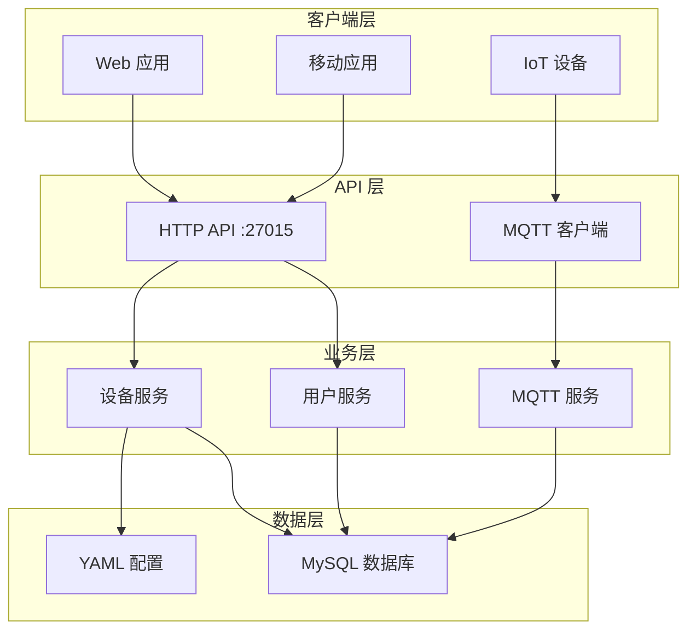

# OMEGA3-IOT 物联网设备管理平台

OMEGA3-IOT 是一个开源的物联网设备管理平台，专为支持设备全生命周期管理而设计。平台采用双协议架构：HTTP REST API 处理用户操作，MQTT 协议处理设备实时通信。

## 🚀 核心特性

- **两阶段设备注册**：设备匿名注册后通过 RegCode 与用户绑定 [1](#0-0) 
- **实时遥测数据**：支持 GPS 位置、电池电量、温度等属性上报 [2](#0-1) 
- **双向通信**：MQTT 协议实现设备命令下发与数据上报 [3](#0-2) 
- **多租户支持**：每个用户管理自己的设备集合
- **类型驱动验证**：基于 YAML 配置的设备类型定义和属性验证 [4](#0-3) 
- **双重认证**：JWT 令牌用于 API 认证，VerifyCode 用于设备数据认证

## 📋 系统要求

- Go 1.24+
- MySQL 5.7+
- MQTT Broker (如 EMQX, Mosquitto)

## 🛠️ 快速开始

### 1. 克隆项目

```bash
git clone https://github.com/ju1c3rSH/OMEGA3-IOT.git
cd OMEGA3-IOT
```

### 2. 安装依赖

```bash
go mod download
```

### 3. 配置数据库

复制并编辑配置文件：
```bash
cp internal/config/GeneralConfig.yaml.example internal/config/GeneralConfig.yaml
```

配置 MySQL 连接信息：
```yaml
database:
  dsn: "username:password@tcp(localhost:3306)/omega3_iot?charset=utf8mb4&parseTime=True&loc=Local"
```

### 4. 启动应用

```bash
go run main.go
```

服务将在以下端口启动：
- HTTP API: `:27015` [5](#0-4) 
- MQTT Broker: `tcp://yuyuko.food:1883` [6](#0-5) 

## 🏗️ 架构概览



## 📚 API 文档

### 用户管理

| 端点 | 方法 | 描述 |
|------|------|------|
| `/api/v1/Register` | POST | 用户注册 [7](#0-6)  |
| `/api/v1/Login` | POST | 用户登录 |
| `/api/v1/GetUserInfo` | GET | 获取用户信息（需认证） |

### 设备管理

| 端点 | 方法 | 描述 |
|------|------|------|
| `/api/v1/DeviceReg` | POST | 设备匿名注册 [8](#0-7)  |
| `/api/v1/BindDeviceByRegCode` | POST | 通过 RegCode 绑定设备 |
| `/api/v1/AddDevice` | POST | 手动添加设备（需认证） |

### MQTT 主题结构

- `data/device/{device_uuid}/properties` - 设备属性上报
- `data/device/{device_uuid}/action` - 服务器命令下发
- `data/device/{device_uuid}/event` - 设备事件上报

## ⚙️ 配置说明

### 设备类型配置

设备类型通过 `device_type_list.yaml` 定义： [2](#0-1) 

```yaml
device_types:
  - id: 1
    name: "BaseTracker"
    description: "基础定位器"
    properties:
      battery_level:
        writable: true
        description: "电量"
        unit: "%"
        range: [0, 100]
        format: "int"
      gps_location:
        writable: false
        description: "GPS位置"
        format: "string"
```

### 环境变量

| 变量名 | 描述 | 必需 |
|--------|------|------|
| `JWT_SECRET` | JWT 令牌签名密钥 | 是 |
| `OMEGA3_IOT` | JWT 发行者标识 | 否 |

## 🔧 开发指南

### 项目结构

```
OMEGA3-IOT/
├── cmd/http-api/          # HTTP API 入口
├── internal/
│   ├── config/           # 配置管理
│   ├── db/              # 数据库连接
│   ├── handler/         # HTTP 请求处理器
│   ├── model/           # 数据模型
│   ├── service/         # 业务逻辑
│   └── utils/           # 工具函数
├── DesignStandard.md    # 设计规范文档
└── go.mod              # Go 模块定义
```

### 添加新设备类型

1. 在 `device_type_list.yaml` 中定义新类型
2. 实现设备特定的属性验证逻辑
3. 更新 `GlobalDeviceTypeManager` [9](#0-8) 

### 数据库迁移

应用启动时会自动执行 GORM 数据库迁移 [10](#0-9) 。

## 🤝 贡献指南

我们欢迎所有形式的贡献！

### 提交 Issue

- 使用 Issue 模板报告 Bug 或提出功能请求
- 提供详细的重现步骤和环境信息

### 提交 Pull Request

1. Fork 项目
2. 创建功能分支 (`git checkout -b feature/AmazingFeature`)
3. 提交更改 (`git commit -m 'Add some AmazingFeature'`)
4. 推送到分支 (`git push origin feature/AmazingFeature`)
5. 创建 Pull Request

### 代码规范

- 遵循 Go 官方代码规范
- JSON 字段使用下划线命名法 [11](#0-10) 
- 添加适当的单元测试

## 📄 许可证

本项目采用 MIT 许可证 - 查看 [LICENSE](LICENSE) 文件了解详情。

## 🙏 致谢

- [Gin](https://github.com/gin-gonic/gin) - HTTP Web 框架
- [GORM](https://gorm.io/) - Go ORM 库
- [Eclipse Paho MQTT](https://github.com/eclipse/paho.mqtt.golang) - MQTT 客户端库
- [Viper](https://github.com/spf13/viper) - 配置管理

## 📞 联系我们

- 项目主页: https://github.com/ju1c3rSH/OMEGA3-IOT
- 问题反馈: https://github.com/ju1c3rSH/OMEGA3-IOT/issues

---

## Notes

这个 README 基于 OMEGA3-IOT 项目的实际代码结构和设计文档编写。项目实现了完整的 IoT 设备管理生命周期，包括设备注册、用户绑定、数据上报和命令控制等核心功能。代码采用模块化设计，便于扩展和维护。

Wiki pages you might want to explore:
- [OMEGA3-IOT System Overview (ju1c3rSH/OMEGA3-IOT)](/wiki/ju1c3rSH/OMEGA3-IOT#1)
- [System Architecture (ju1c3rSH/OMEGA3-IOT)](/wiki/ju1c3rSH/OMEGA3-IOT#3)
- [Device Lifecycle & Registration (ju1c3rSH/OMEGA3-IOT)](/wiki/ju1c3rSH/OMEGA3-IOT#5.1)

### Citations

**File:** DesignStandard.md (L4-8)
```markdown
## 1. JSON 字段命名规范
- 所有 JSON 字段名使用小写字母
- 不同单词间使用下划线 `_` 分割
- 保持一致性，避免混用驼峰命名

```

**File:** DesignStandard.md (L38-47)
```markdown
## 4. 设备录入系统流程
```text
设备注册遵循：设备开机通过网络/Lora的方式向主服务器进行报备注册。
Lora需要通过网关。
用户通过后续设备上显示的RegCode向服务器发送请求，将设备绑定至用户。

流程：匿名注册——> 临时UUID和RegCode与VerifyCode，开辟当前UUID的Topic——>RegCode被使用，Topic下发指令，停止重置计时，并在服务端处转为正式UUID，存入数据库
在存入instance表之后，服务端在broker发布一条广播：
/data/device/{Device_UUID}/action 其含有GO_ON的信息，设备会在此前订阅这里，接收到之后开始工作。
```
```

**File:** internal/config/device_type_list.yaml (L1-34)
```yaml
device_types:
  - id: 1
    name: "BaseTracker" #also called type
    description: "A Tracker"
    properties:
      battery_level:
        writable: true
        description: "电量"
        unit: "%"
        range: [0, 100]
        format: "int"
      
      gps_location:
        writable: false
        description: "GPS位置"
        format: "string"

  - id: 2
    name: "SmartSensor"
    description: "智能传感器"
    properties:
      temperature:
        writable: false
        description: "温度"
        unit: "°C"
        range: [-40, 85]
        format: "float"
      
      humidity:
        writable: false
        description: "湿度"
        unit: "%"
        range: [0, 100]
```

**File:** internal/service/mqtt_service.go (L23-36)
```go
type DeviceMessage struct {
	VerifyCode string `json:"verify_code"`
	TimeStamp  int64  `json:"timestamp"`
	Data       Data   `json:"data"`
}

type Data struct {
	Properties map[string]model.PropertyItem `json:"properties"`
	Event      model.Event                   `json:"event"`
	Action     model.Action                  `json:"action"`
}
type Publisher interface {
	PublishActionToDevice(deviceUUID string, actionName string, payload interface{}) error
}
```

**File:** internal/model/device.go (L105-158)
```go
type DeviceTypeManager struct {
	types map[string]*DeviceType
	ids   map[int]*DeviceType
	mu    sync.RWMutex
}

var GlobalDeviceTypeManager = &DeviceTypeManager{
	types: make(map[string]*DeviceType),
	ids:   make(map[int]*DeviceType),
}

func (dtm *DeviceTypeManager) LoadDeviceTypeFromYAML(filePath string) error {
	//TODO 也许这里可以封装起来，让其可以load any?

	v := viper.New()
	v.SetConfigFile(filePath)
	v.SetConfigType("yaml")
	if err := v.ReadInConfig(); err != nil {
		return fmt.Errorf("could not load config: %v", err)
	}

	//var deviceTypes []*DeviceType不适用指针数组
	var deviceTypesConfig struct {
		DeviceTypes []DeviceType `mapstructure:"device_types" yaml:"device_types"`
	}
	if err := v.Unmarshal(&deviceTypesConfig); err != nil {
		return fmt.Errorf("could not unmarshal config: %v", err)
	}

	dtm.mu.Lock()
	defer dtm.mu.Unlock()

	dtm.types = make(map[string]*DeviceType)
	dtm.ids = make(map[int]*DeviceType)

	for i, dt := range deviceTypesConfig.DeviceTypes {
		deviceType := &dt
		fmt.Printf("Processing: %+v\n", deviceType)

		if deviceType.Name == "" {
			fmt.Printf("Warning: Device type %d has empty name\n", i)
			continue
			//debug msg...
		}
		if deviceType.ID <= 0 {
			fmt.Printf("Warning: Device type %s has invalid ID\n", deviceType.Name)
			continue
		}

		dtm.ids[deviceType.ID] = deviceType
		dtm.types[deviceType.Name] = deviceType
	}
	return nil
}
```

**File:** cmd/http-api/main.go (L28-29)
```go
	log.Println("Starting server on :27015")
	return r.Run(":27015")
```

**File:** main.go (L33-33)
```go
	db.InitDB(cfg)
```

**File:** main.go (L36-36)
```go
	brokerURL := "tcp://yuyuko.food:1883"
```

**File:** internal/handler/user_handlers.go (L26-47)
```go
func (h *UserHandler) Register(c *gin.Context) {
	var input model.RegUser
	if err := c.ShouldBind(&input); err != nil {
		c.JSON(http.StatusBadRequest, gin.H{"error": err.Error()})
		return
	}

	user, err := h.userService.Register(input.Username, input.Password, c.ClientIP())
	if err != nil {
		if err == gorm.ErrDuplicatedKey {
			c.JSON(http.StatusBadRequest, gin.H{"error": "Username already taken"})
			return
		}
		c.JSON(http.StatusInternalServerError, gin.H{"error": "Failed to register user: " + err.Error()})
		return
	}

	c.JSON(http.StatusOK, gin.H{
		"message": "User created successfully",
		"user":    user,
	})
}
```

**File:** internal/handler/device_handlers.go (L65-110)
```go
func DeviceRegisterAnonymously(c *gin.Context) {
	var input struct {
		DeviceTypeID int `form:"device_type_id" binding:"required"`
	}

	if err := c.ShouldBind(&input); err != nil {
		c.JSON(http.StatusBadRequest, gin.H{"error": "Invalid or missing query parameter", "details": err.Error()})
		return
	}
	verifyCode, err := utils.GenerateVerifyCode()
	if err != nil {
		log.Printf("Failed to generate verify code: %v", err)
		c.JSON(http.StatusInternalServerError, gin.H{"error": "Failed to generate verification code"})
		return
	}

	//verifyHash := utils.HashVerifyCode(verifyCode)

	record, err := deviceService.RegisterDeviceAnonymously(input.DeviceTypeID, verifyCode)
	{
		if err != nil {
			if err == gorm.ErrDuplicatedKey {
				c.JSON(http.StatusBadRequest, gin.H{"error": "Device name already exists"})
				return
			}
			if err == gorm.ErrInvalidData {
				c.JSON(http.StatusBadRequest, gin.H{"error": "Unsupported device type"})
				return
			}
			c.JSON(http.StatusInternalServerError, gin.H{"error": "Failed to create device: " + err.Error()})
			return
		}
	}
	c.JSON(http.StatusOK, gin.H{
		"code":    http.StatusOK,
		"message": "Device Registered successfully",
		"device": gin.H{
			"id":          record.ID,
			"uuid":        record.DeviceUUID,
			"reg_code":    record.RegCode,
			"type":        record.DeviceTypeID,
			"expires_at":  record.ExpiresAt,
			"verify_code": verifyCode,
		},
	})
}
```


[](https://deepwiki.com/ju1c3rSH/OMEGA3-IOT)
